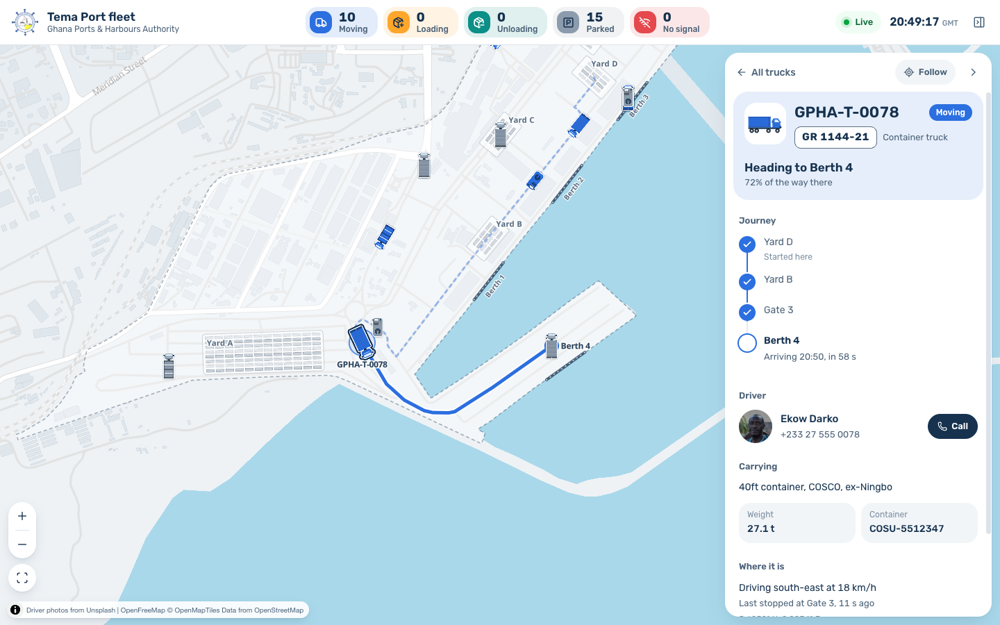

# GPHA Cargo Tracker

A pitch-ready proof of concept for Ghana Ports and Harbours Authority: a live Tema Port operations dashboard with simulated cargo trucks, status changes, route progress, and a searchable fleet panel.

## Getting Started

Install dependencies and run the development server:

```bash
npm run dev
```

Open [http://localhost:3000](http://localhost:3000) with your browser to see the result.

For the intended demo experience, open the app on desktop or tablet.



## Demo Flow

- The first load connects to the SSE simulator. The header shows the live-feed pill, the port clock (GMT) and one tile per status with its icon and count.
- Trucks move around a daylight map of Tema Port. Each status has its own container colour: blue for moving, orange for loading, teal for unloading, grey for parked and red for no signal.
- Tap a status tile in the header, or a chip in the panel, to filter the fleet; other trucks fade on the map.
- Search by truck ID, plate or driver, then click a row or marker for details. Each truck type (container truck, flatbed, tanker, terminal tractor) has its own illustration on the map and in the list.
- Selecting a moving truck draws its route on the map and shows its journey stop by stop with an arrival time. Turn on Follow to keep it in view, or call the driver from the panel.
- Trucks that lose signal get a red badge on the map, and the panel says when and where they were last seen.

## Port Map Data

The simulated trucks drive on the real road network of Tema Port. `data/port-graph.json` (places and the roads between them) and `data/port-overlay.json` (port outline, berths and yards) are generated from OpenStreetMap by:

```bash
node scripts/build-port-graph.mjs            # rebuild from the cached extract in data/osm/
node scripts/build-port-graph.mjs --refresh  # download fresh roads from the Overpass API first
```

Edit the `PLACES` list in the script to move a gate, berth or yard; each place snaps to the nearest drivable road. Road data © OpenStreetMap contributors, available under the ODbL.

Driver photos are Unsplash portraits, hotlinked as Unsplash's API guidelines require, with each photographer credited in `data/trucks-seed.json` (`driver.photoCredit`) and Unsplash credited in the map attribution. The URLs use Unsplash's face-centred crop (`fit=facearea`). Drivers without a `photoUrl` show their initials. The Unsplash access key used to find the photos lives in `.env.local` (`UNSPLASH_ACCESS_KEY`); the app itself does not need it at runtime.

## Pitch Talking Points

- Real GPS feeds can replace the simulator behind the same stream contract.
- The dashboard is intentionally database-free for the POC, keeping the live demo cheap and simple.
- The UI already demonstrates operational patterns GPHA will care about: live location, cargo context, last stop, route progress, offline vehicles, and recent unload history.
- SSE is a good fit for one-way tracker updates and works well with Vercel-hosted Node.js functions.

## Phase 2 Backlog

- Real GPS ingestion via authenticated webhook.
- Persistence with Postgres for truck history and replay.
- Historical playback with a time scrubber.
- Dwell-time reports and berth throughput analytics.
- Alert rules for long stops, route deviation, and offline trackers.
- Auth and operator/supervisor roles.
- Multi-port support for Takoradi and future terminals.
- Geofencing and manifest/customs integrations.

## Deploy

Deploy on Vercel as a Next.js project. The planned memorable alias is `gpha-tracker.vercel.app`.
